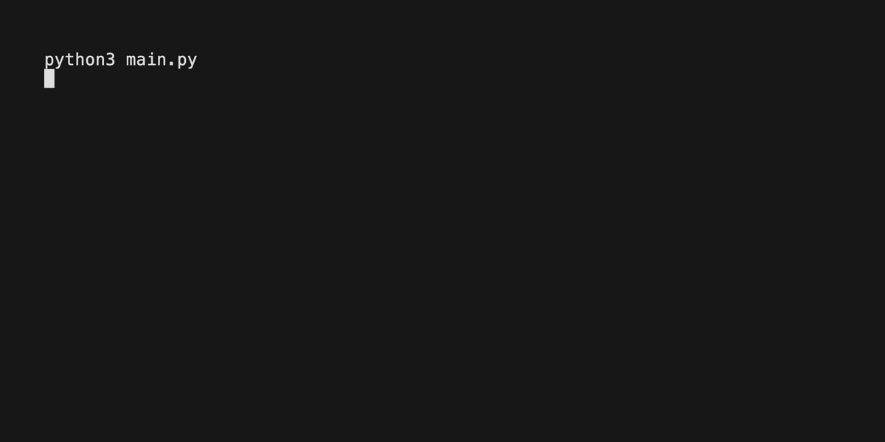

# KNZO - Animated Logs



## TODO

- Add docs
- Add support for progress bars

KNZO is a wrapper of the Python `rich` library that allows for logs and terminal content to be scripted and displayed.

KNZO outputs the scripted log directly to the terminal. However I am working on adding support for outputting the contents to an actual log file.

Also on support for using `vhs` to allow the script to be recording and output as a GIF, MP4, or series of frames for use in video editing.

## Examples and Demos

Example code is in the `examples` folder, and demos are in the `demos` folder.
If you want to run the example code,
simply run:

```bash
python -m examples.MODULE_NAME
```

OR

```bash
python -m demos.MODULE_NAME
```

For instance, running the spinner example:
`python -m examples.spinner`

or to run the ramblings demo:
`python -m demos.ramblings`
